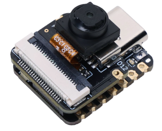
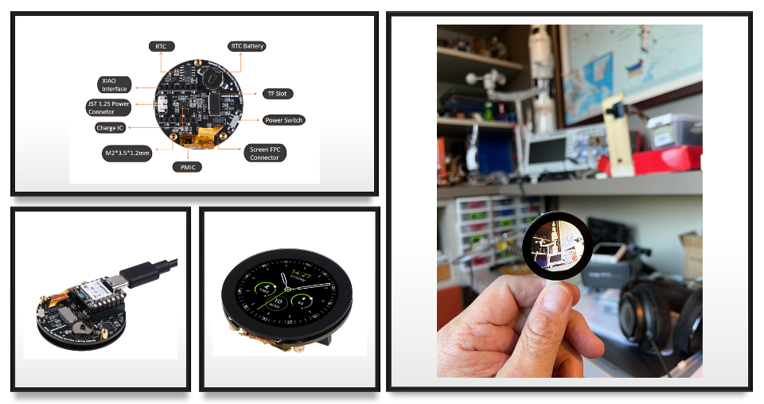
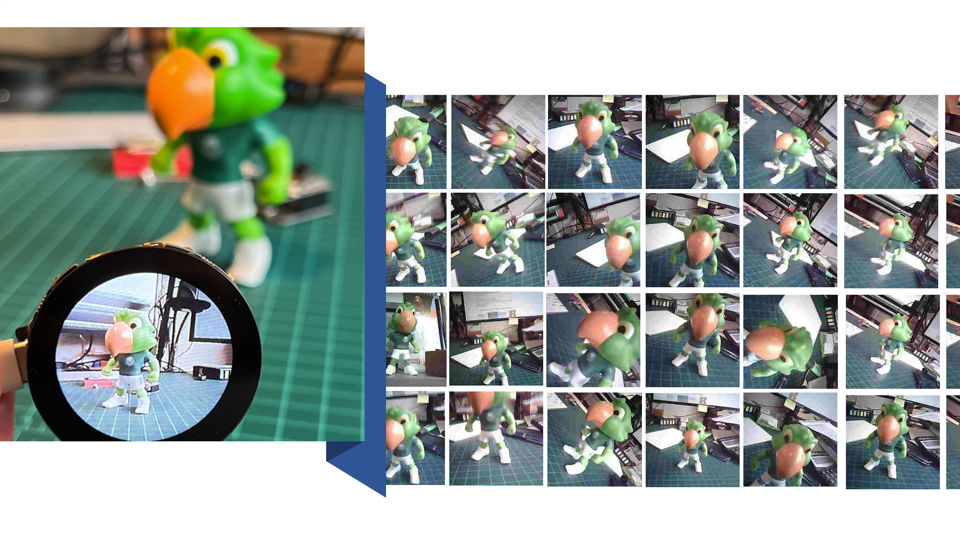

# XIAO-ESP32S3-Sense

This repository contains the code used on the TinyML tutorials: 
- Image/Camera - "Image Classification":  [[Web version]](https://www.hackster.io/mjrobot/tinyml-made-easy-image-classification-cb42ae) -  [[pdf]](https://github.com/Mjrovai/XIAO-ESP32S3-Sense/blob/main/1.XIAO_ESP32S3-Image_Classification.pdf)

- Motion/Accelerometer - "Motion Classification and Anomaly Detection":  [[Web version]](https://www.hackster.io/mjrobot/exploring-machine-learning-with-the-new-xiao-esp32s3-6463e5) -  [[pdf]](https://github.com/Mjrovai/XIAO-ESP32S3-Sense/blob/main/2.XIAO_ESP32S3-Motion_Classification.pdf)
- Sound/Microphone - "Keyword Spotting (KWS)":  [[Web version]](https://www.hackster.io/mjrobot/tinyml-made-easy-keyword-spotting-kws-5fa6e7) -  [[pdf]](https://github.com/Mjrovai/XIAO-ESP32S3-Sense/blob/main/3.XIAO_ESP32S3-Keyword_Spotting.pdf)

## The XIAO-ESP32S3-Sense
Seeed Studio XIAO ESP32S3 Sense integrates a camera sensor, digital microphone, and SD card support. Combining embedded ML computing power and photography capability, this development board is a great tool to get started with TinyML (intelligent voice and vision AI).

- Webpage: https://www.seeedstudio.com/XIAO-ESP32S3-Sense-p-5639.html
- WiKi: https://wiki.seeedstudio.com/xiao_esp32s3_getting_started/

## Features
* Powerful MCU Board: Incorporate the ESP32S3 32-bit, dual-core, Xtensa processor chip operating up to 240 MHz, mounted multiple development ports, Arduino / MicroPython supported
* Advanced Functionality (for Sense): Detachable OV2640 camera sensor for 1600*1200 resolution, compatible with OV5640 camera sensor, integrating additional digital microphone
* Elaborate Power Design: Lithium battery charge management capability offer 4 power consumption model, which allows for deep sleep mode with power consumption as low as 14μA
* Great Memory for more Possibilities: Offer 8MB PSRAM and 8MB FLASH, supporting SD card slot for external 32GB FAT memory
* Outstanding RF performance: Support 2.4GHz Wi-Fi and BLE dual wireless communication, support 100m+ remote communication when connected with U.FL antenna
* Thumb-sized Compact Design: 21 x 17.5mm, adopting the classic form factor of XIAO, suitable for space-limited projects like wearable devices

## The Round Display for XIAO
- [WebPage](https://www.seeedstudio.com/Seeed-Studio-Round-Display-for-XIAO-p-5638.html)
- [WikiPage](https://wiki.seeedstudio.com/get_start_round_display/)

Seeed Studio Round Display for XIAO is an expansion board compatible with all the XIAO family development boards. It features a fully covered touch screen on one side, designed as a 39mm disc. It contains an onboard RTC holder, charge chip, and TF card slot within its compact size, perfect for interactive displays in smart homes, wearables, and more.

* 1.28-inch round touch screen, 
* 240×240 resolution, 
* 65k colors, 
* RTC, 
* charge IC, 
* TF card slot, 
* JST 1.25 connector, 
* All XIAO Compatible,

### Code
The code [camera_round_display_save_jpeg](camera_round_display_save_jpeg) can be used for Data collection.

